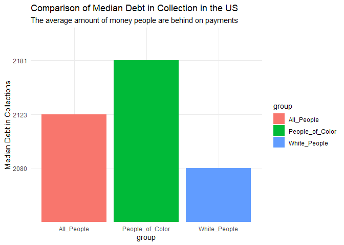
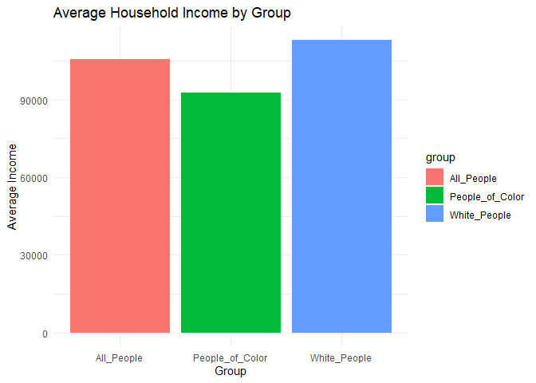

Graphs_4500
================
2025-04-07

## R Markdown

Below is my graphs for our debt project. The graph below is looking at a
comparison between people of color and white people for median debt
collections. Median debt collections is the average amount that people
are behind on payments.

``` r
library(ggplot2)
```

    ## Warning: package 'ggplot2' was built under R version 4.2.3

``` r
library(dplyr)
```

    ## Warning: package 'dplyr' was built under R version 4.2.3

    ## 
    ## Attaching package: 'dplyr'

    ## The following objects are masked from 'package:stats':
    ## 
    ##     filter, lag

    ## The following objects are masked from 'package:base':
    ## 
    ##     intersect, setdiff, setequal, union

``` r
library(readxl)
```

    ## Warning: package 'readxl' was built under R version 4.2.3

``` r
#import the data
Debt_2024 <- read_excel("dia_lbls_all_overall_usa_2023_1Jul2024.xlsx")


#rename the data
names(Debt_2024) <- c("country", "share_with_debt_all", "share_with_debt_color", "share_with_debt_white", "median_debt_all", "median_debt_color", "median_debt_white", "medical_debt_all", "medical_debt_color", "medical_debt_white", "student_all", "student_color", "student_white", "auto_all", "auto_color", "auto_white", "creditcard_del_all", "creditcard_del_color", "creditcard_del_white", "median_creditcard_all", "median_creditcard_color", "median_creditcard_white", "share_color", "avg_house_income_all", "avg_house_income_color", "avg_house_income_white")

#create a subset for the thing you want to look at
subset_debt_2024 <- select(Debt_2024, median_debt_all, median_debt_color, median_debt_white)
names(subset_debt_2024) <- c("All_People","People_of_Color", "White_People")


#create another subset in the long format
subset_debt_2024_long <- tidyr::pivot_longer(subset_debt_2024, cols = everything(), names_to = "group", values_to = "median_debt")


#create the plot
ggplot(subset_debt_2024_long, aes(x = group, y = median_debt, fill = group)) +
  geom_bar(stat = "identity") +
  labs(title = "Comparison of Median Debt in Collection in the US", subtitle = "The average amount of money people are behind on payments", y = "Median Debt in Collections") +
  theme_minimal()
```

<!-- -->

``` r
#create another graph from same data set

subset_income_2024 <- select(Debt_2024, avg_house_income_all, avg_house_income_color, avg_house_income_white)
names(subset_income_2024) <- c("All_People","People_of_Color", "White_People")


#create another subset in the long format
subset_income_2024_long <- tidyr::pivot_longer(subset_income_2024, cols = everything(), names_to = "group", values_to = "avg_household_income")


subset_income_2024_long$avg_household_income <- as.numeric(as.character(subset_income_2024_long$avg_household_income))

#create the plot
ggplot(subset_income_2024_long, aes(x = group, y = avg_household_income, fill = group)) +
  geom_bar(stat = "identity") +
  labs(title = "Average Household Income by Group",
       x = "Group",
       y = "Average Income") +
  theme_minimal()
```

<!-- -->
