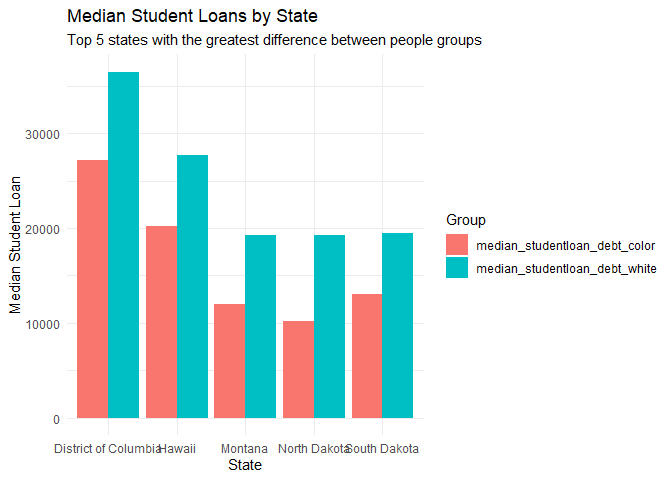

Graphs_4500
================
2025-04-07

## R Markdown

Below is my graphs for our debt project. The graph below is looking at a
comparison between people of color and white people for median debt
collections. Median debt collections is the average amount that people
are behind on payments.

``` r
library(ggplot2)
```

    ## Warning: package 'ggplot2' was built under R version 4.2.3

``` r
library(dplyr)
```

    ## Warning: package 'dplyr' was built under R version 4.2.3

    ## 
    ## Attaching package: 'dplyr'

    ## The following objects are masked from 'package:stats':
    ## 
    ##     filter, lag

    ## The following objects are masked from 'package:base':
    ## 
    ##     intersect, setdiff, setequal, union

``` r
library(readxl)
```

    ## Warning: package 'readxl' was built under R version 4.2.3

``` r
library(reshape2)
```

    ## Warning: package 'reshape2' was built under R version 4.2.3

``` r
#import the data
Debt_2024 <- read_excel("dia_lbls_all_overall_usa_2023_1Jul2024.xlsx")


#rename the data
names(Debt_2024) <- c("country", "share_with_debt_all", "share_with_debt_color", "share_with_debt_white", "median_debt_all", "median_debt_color", "median_debt_white", "medical_debt_all", "medical_debt_color", "medical_debt_white", "student_all", "student_color", "student_white", "auto_all", "auto_color", "auto_white", "creditcard_del_all", "creditcard_del_color", "creditcard_del_white", "median_creditcard_all", "median_creditcard_color", "median_creditcard_white", "share_color", "avg_house_income_all", "avg_house_income_color", "avg_house_income_white")

#create a subset for the thing you want to look at
subset_debt_2024 <- select(Debt_2024, median_debt_all, median_debt_color, median_debt_white)
names(subset_debt_2024) <- c("All_People","People_of_Color", "White_People")


#create another subset in the long format
subset_debt_2024_long <- tidyr::pivot_longer(subset_debt_2024, cols = everything(), names_to = "group", values_to = "median_debt")


#create the plot
ggplot(subset_debt_2024_long, aes(x = group, y = median_debt, fill = group)) +
  geom_bar(stat = "identity") +
  labs(title = "Comparison of Median Debt in Collection in the US", subtitle = "The average amount of money people are behind on payments", y = "Median Debt in Collections") +
  theme_minimal()
```

<!-- -->

``` r
#create another graph from same data set

subset_income_2024 <- select(Debt_2024, avg_house_income_all, avg_house_income_color, avg_house_income_white)
names(subset_income_2024) <- c("All_People","People_of_Color", "White_People")


#create another subset in the long format
subset_income_2024_long <- tidyr::pivot_longer(subset_income_2024, cols = everything(), names_to = "group", values_to = "avg_household_income")


subset_income_2024_long$avg_household_income <- as.numeric(as.character(subset_income_2024_long$avg_household_income))

#create the plot
ggplot(subset_income_2024_long, aes(x = group, y = avg_household_income, fill = group)) +
  geom_bar(stat = "identity") +
  labs(title = "Average Household Income by Group",
       x = "Group",
       y = "Average Income") +
  theme_minimal()
```

<!-- -->

\#student debt by state

``` r
student_loan_debt_2023 <- read_excel("dia_lbls_all_student_state_2023_1Jul2024.xlsx")

names(student_loan_debt_2023) <- c("state_FIPS", "state_name", "state_abbreviation", "share_with_studentloan_debt_all", "share_with_studentloan_debt_color", "share_with_studentloan_debt_white", "median_studentloan_debt_all", "median_studentloan_debt_color", "median_studentloan_debt_white", "share_of_holders_with_debt_all", "share_of_holders_with_debt_color", "share_of_holders_with_debt_white", "median_loan_debt_in_default_all", "median_loan_debt_in_default_color", "median_loan_debt_in_default_white", "median_monthly_studentloan_payment_all", "median_monthly_studentloan_payment_color", "median_monthly_studentloan_payment_white", "share_without_bachelors_all", "share_without_bachelors_color", "share_without_bachelors_white", "share_of_people_of_color", "average_household_income_all", "average_household_income_color", "average_household_income_white")

subset_student_loan_debt <- select(student_loan_debt_2023, state_FIPS, state_name, state_abbreviation, median_studentloan_debt_all, median_studentloan_debt_color, median_studentloan_debt_white)

subset_student_loan_debt$median_studentloan_debt_all <- as.numeric(as.character(subset_student_loan_debt$median_studentloan_debt_all))

#sort the data in descending order and find top 5 states with the highest median student loan debt
sorted_student_loan_data <- subset_student_loan_debt |> arrange(desc(median_studentloan_debt_all))

top_five_states_with_student_loan_debt <- head(sorted_student_loan_data, 5)


#create a bar chart comparing these top 5 states
ggplot(top_five_states_with_student_loan_debt, aes(x = state_name, y = median_studentloan_debt_all)) +
  geom_bar(stat = "identity", fill = "skyblue") +
  labs(title = "Median Student Loan Debt for Top Five States",
       x = "State",
       y = "Median Student Loan Debt (All)") +
  ylim(0, max(top_five_states_with_student_loan_debt$median_studentloan_debt_all) + 5000) +
  theme_minimal()
```

<!-- -->

Code for coloring the bars based off of people group

``` r
melted_data <- melt(top_five_states_with_student_loan_debt, id.vars = "state_name", 
                    measure.vars = c("median_studentloan_debt_color", "median_studentloan_debt_white"),
                    variable.name = "Group", value.name = "Median_Student_Loan_Debt")

melted_data$Median_Student_Loan_Debt <- as.numeric(as.character(melted_data$Median_Student_Loan_Debt))


ggplot(melted_data, aes(x = state_name, y = Median_Student_Loan_Debt, fill = Group)) +
  geom_bar(stat = "identity", position = "stack") +
  geom_text(aes(label = Median_Student_Loan_Debt), position = position_stack(vjust = 0.5), size = 3) +
  labs(title = "Median Student Loan Debt for Top Five States",
       x = "State",
       y = "Median Student Loan Debt") +
  scale_fill_manual(values = c("median_studentloan_debt_color" = "skyblue", "median_studentloan_debt_white" = "orange"),
                    labels = c("Colored People", "White People")) +
  theme_minimal()
```

<!-- -->

Now lets do the states with the most difference between colored people
and white people

``` r
#first create a column for the difference between median for colored people and white people
subset_student_loan_debt$median_studentloan_debt_color <- as.numeric(as.character(subset_student_loan_debt$median_studentloan_debt_color))
```

    ## Warning: NAs introduced by coercion

``` r
subset_student_loan_debt$median_studentloan_debt_white <- as.numeric(as.character(subset_student_loan_debt$median_studentloan_debt_white))

subset_student_loan_debt$Difference <- subset_student_loan_debt$median_studentloan_debt_color - subset_student_loan_debt$median_studentloan_debt_white

subset_student_loan_debt$Difference <- as.numeric(as.character(subset_student_loan_debt$Difference))

sorted_data_for_biggest_diff <- subset_student_loan_debt |> arrange(desc(Difference))

top_five_states_difference <- head(sorted_data_for_biggest_diff, 5)

melted_data_difference <- melt(top_five_states_difference, id.vars = "state_name", 
                    measure.vars = c("median_studentloan_debt_color", "median_studentloan_debt_white"),
                    variable.name = "Group", value.name = "Median_Student_Loan_Debt_Diff")


#now create the graph
ggplot(melted_data_difference, aes(x = state_name, y = Median_Student_Loan_Debt_Diff, fill = Group)) +
  geom_bar(stat = "identity", position = "stack") +
  geom_text(aes(label = Median_Student_Loan_Debt_Diff), position = position_stack(vjust = 0.5), size = 3) +
  labs(title = "Median Student Loan Debt for Top Five States with Greatest Difference",
       x = "State",
       y = "Median Student Loan Debt") +
  scale_fill_manual(values = c("median_studentloan_debt_color" = "skyblue", "median_studentloan_debt_white" = "orange"),
                    labels = c("Colored People", "White People")) +
  theme_minimal()
```

<!-- -->
