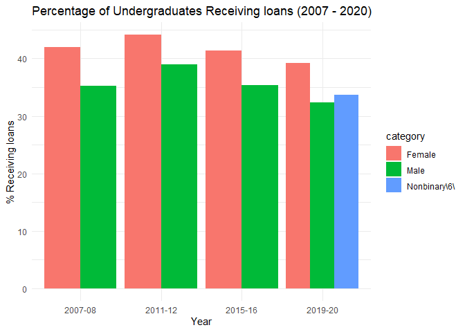
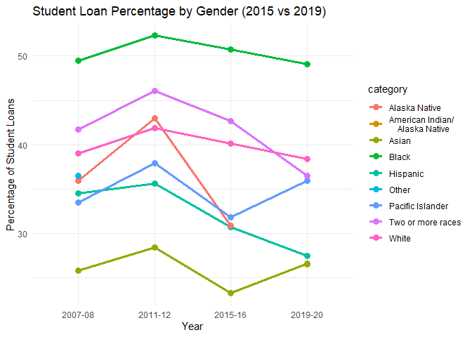
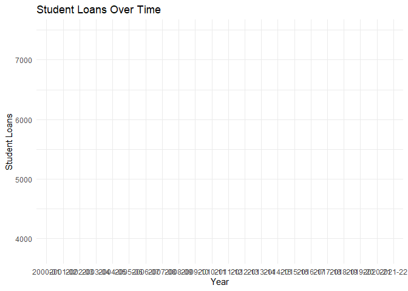

restructure_dataset
================
2025-04-21

## R Markdown

importing the huge data set that needs lots of restructuring.

``` r
library(ggplot2)
```

    ## Warning: package 'ggplot2' was built under R version 4.2.3

``` r
library(dplyr)
```

    ## Warning: package 'dplyr' was built under R version 4.2.3

    ## 
    ## Attaching package: 'dplyr'

    ## The following objects are masked from 'package:stats':
    ## 
    ##     filter, lag

    ## The following objects are masked from 'package:base':
    ## 
    ##     intersect, setdiff, setequal, union

``` r
library(readxl)
```

    ## Warning: package 'readxl' was built under R version 4.2.3

``` r
library(reshape2)
```

    ## Warning: package 'reshape2' was built under R version 4.2.3

``` r
library(tidyr)
```

    ## Warning: package 'tidyr' was built under R version 4.2.3

    ## 
    ## Attaching package: 'tidyr'

    ## The following object is masked from 'package:reshape2':
    ## 
    ##     smiths

``` r
library(shiny)
```

    ## Warning: package 'shiny' was built under R version 4.2.3

``` r
library(plotly)
```

    ## Warning: package 'plotly' was built under R version 4.2.3

    ## 
    ## Attaching package: 'plotly'

    ## The following object is masked from 'package:ggplot2':
    ## 
    ##     last_plot

    ## The following object is masked from 'package:stats':
    ## 
    ##     filter

    ## The following object is masked from 'package:graphics':
    ## 
    ##     layout

``` r
#import the data
tabn331_10 <- read_excel("tabn331.10.xlsx", 
      skip = 4, n_max = 43)
```

    ## New names:
    ## • `` -> `...4`
    ## • `` -> `...5`
    ## • `` -> `...7`
    ## • `` -> `...8`
    ## • `` -> `...10`
    ## • `` -> `...11`
    ## • `` -> `...13`
    ## • `` -> `...14`
    ## • `` -> `...16`
    ## • `` -> `...17`
    ## • `` -> `...19`
    ## • `` -> `...20`
    ## • `` -> `...22`
    ## • `` -> `...23`
    ## • `` -> `...25`
    ## • `` -> `...26`
    ## • `` -> `...28`
    ## • `` -> `...29`
    ## • `` -> `...31`
    ## • `` -> `...32`

``` r
#make a copy of your data set

big_dataset <- tabn331_10

#remove the rows and columns that are only NA values

big_dataset <- big_dataset[-c(2, 6, 14, 18, 22, 25, 39), ]


big_dataset <- big_dataset[, colSums(is.na(big_dataset)) != nrow(big_dataset)]

#rename the columns
names(big_dataset) <- c("category", "total_in_thousands", "total_anyaid", "se_total_anyaid", "federal_anyaid", "se_federal_anyaid", "nonfederal_anyaid", "se_nonfederal_anyaid", "total_grants", "se_total_grant", "federal_grants", "se_federal_grants", "nonfederal_grants", "se_nonfederal_grants", "total_loans", "se_total_loans", "federal_loans", "se_federal_loans", "nonfederal_loans","remove_1" ,"se_nonfederal_loans", "total_workstudy","remove_2" ,"se_total_workstudy")

#remove those final columns
big_dataset <- big_dataset %>% select(-remove_1, -remove_2)

#add a column for the year of the dataset
big_dataset <- big_dataset %>% mutate(year = "2019-20")
```

Now I have the data cleaned with all the NA’s removed. I am going to
create subsets of the data for each category such as age, gender, race,
etc.

``` r
#dataset for gender
big_dataset_gender <- big_dataset[2:4, ]

#dataset for race
big_dataset_race <- big_dataset[5:11, ]

#for age
big_dataset_age <- big_dataset[12:14, ]

#for marital status
big_dataset_marital <- big_dataset[15:17, ]

#for attendance status
big_dataset_attendance <- big_dataset[18:19, ]

#for dependency status and income (income by dependency status)
big_dataset_dependency_and_income <- big_dataset[20:32, ]

#for housing status
big_dataset_housing <- big_dataset[33:36, ]
```

Now I need to import and try to merge the data

``` r
table_for_2015 <- read_excel("table_for_2015.xls", 
      skip = 4)
```

    ## New names:
    ## • `` -> `...4`
    ## • `` -> `...6`
    ## • `` -> `...8`
    ## • `` -> `...10`
    ## • `` -> `...12`
    ## • `` -> `...14`
    ## • `` -> `...16`
    ## • `` -> `...18`
    ## • `` -> `...20`
    ## • `` -> `...22`
    ## • `` -> `...23`

``` r
table_for_2015 <- table_for_2015[-c(2, 5, 6, 12, 15, 16, 20, 21, 25, 26, 29, 30, 31, 45, 46, 48, 51, 52, 53, 54, 55, 56, 57, 58, 59, 60, 61), ]

names(table_for_2015) <- c("category", "total_in_thousands", "total_anyaid", "se_total_anyaid", "federal_anyaid", "se_federal_anyaid", "nonfederal_anyaid", "se_nonfederal_anyaid", "total_grants", "se_total_grant", "federal_grants", "se_federal_grants", "nonfederal_grants", "se_nonfederal_grants", "total_loans", "se_total_loans", "federal_loans", "se_federal_loans", "nonfederal_loans", "se_nonfederal_loans", "total_workstudy","remove_2" ,"se_total_workstudy")

table_for_2015 <- table_for_2015[, !names(table_for_2015) %in% "remove_2"]

table_for_2015 <- table_for_2015 %>% mutate(year = "2015-16")

#dataset for gender
table_for_2015_gender <- table_for_2015[2:3, ]

#dataset for 
table_for_2015_race <- table_for_2015[4:10, ]

#for age
table_for_2015_age <- table_for_2015[11:13, ]

#for marital status
table_for_2015_marital <- table_for_2015[14:16, ]

#for attendance status
table_for_2015_attendance <- table_for_2015[17:18, ]

#for dependency status and income (income by dependency status)
table_for_2015_dependency_and_income <- table_for_2015[19:31, ]

#for housing status
table_for_2015_housing <- table_for_2015[32:34, ]

#testing the merge
merged_df <- bind_rows(table_for_2015_gender, big_dataset_gender)
```

merge another year

``` r
table_for_2011 <- read_excel("table_for_2011.xlsx", 
      skip = 4)
```

    ## New names:
    ## • `` -> `...4`
    ## • `` -> `...6`
    ## • `` -> `...8`
    ## • `` -> `...10`
    ## • `` -> `...12`
    ## • `` -> `...14`
    ## • `` -> `...16`
    ## • `` -> `...18`
    ## • `` -> `...20`
    ## • `` -> `...22`
    ## • `` -> `...23`

``` r
table_for_2011 <- table_for_2011[-c(2, 5, 6, 12, 15, 16, 20, 21, 25, 26, 29, 30, 31, 45, 46, 48, 51, 52, 53, 54, 55, 56, 57, 58, 59, 60, 61), ]

names(table_for_2011) <- c("category", "total_in_thousands", "total_anyaid", "se_total_anyaid", "federal_anyaid", "se_federal_anyaid", "nonfederal_anyaid", "se_nonfederal_anyaid", "total_grants", "se_total_grant", "federal_grants", "se_federal_grants", "nonfederal_grants", "se_nonfederal_grants", "total_loans", "se_total_loans", "federal_loans", "se_federal_loans", "nonfederal_loans", "se_nonfederal_loans", "total_workstudy","remove_2" ,"se_total_workstudy")

table_for_2011 <- table_for_2011[, !names(table_for_2011) %in% "remove_2"]

table_for_2011 <- table_for_2011 %>% mutate(year = "2011-12")

#dataset for gender
table_for_2011_gender <- table_for_2011[2:3, ]

#dataset for 
table_for_2011_race <- table_for_2011[4:10, ]

#for age
table_for_2011_age <- table_for_2011[11:13, ]

#for marital status
table_for_2011_marital <- table_for_2011[14:16, ]

#for attendance status
table_for_2011_attendance <- table_for_2011[17:18, ]

#for dependency status and income (income by dependency status)
table_for_2011_dependency_and_income <- table_for_2011[19:31, ]

#for housing status
table_for_2011_housing <- table_for_2011[32:34, ]

merged_2011_through_2022 <- bind_rows(merged_df, table_for_2011_gender)
```

Merge the final years

``` r
table_for_2007 <- read_excel("table_for_2007.xlsx", 
      skip = 4)
```

    ## New names:
    ## • `` -> `...4`
    ## • `` -> `...6`
    ## • `` -> `...8`
    ## • `` -> `...10`
    ## • `` -> `...12`
    ## • `` -> `...13`
    ## • `` -> `...15`
    ## • `` -> `...17`
    ## • `` -> `...19`
    ## • `` -> `...21`
    ## • `` -> `...23`

``` r
table_for_2007 <- table_for_2007[-c(2, 5, 6, 11, 16, 17, 21, 22, 26, 27, 30, 31, 32, 46, 47, 49, 52, 53, 54, 55, 56, 57, 58, 59, 60, 61, 62), ]

names(table_for_2007) <- c("category", "total_in_thousands", "total_anyaid", "se_total_anyaid", "federal_anyaid", "se_federal_anyaid", "nonfederal_anyaid", "se_nonfederal_anyaid", "total_grants", "se_total_grant", "federal_grants", "remove_1", "se_federal_grants", "nonfederal_grants", "se_nonfederal_grants", "total_loans", "se_total_loans", "federal_loans", "se_federal_loans", "nonfederal_loans", "se_nonfederal_loans", "total_workstudy","se_total_workstudy")

table_for_2007 <- table_for_2007[, !names(table_for_2007) %in% "remove_1"]

table_for_2007 <- table_for_2007 %>% mutate(year = "2007-08")

#dataset for gender
table_for_2007_gender <- table_for_2007[2:3, ]

#dataset for race
table_for_2007_race <- table_for_2007[4:11, ]

#for age
table_for_2007_age <- table_for_2007[12:14, ]

#for marital status
table_for_2007_marital <- table_for_2007[15:17, ]

#for attendance status
table_for_2007_attendance <- table_for_2007[18:19, ]

#for dependency status and income (income by dependency status)
table_for_2007_dependency_and_income <- table_for_2007[20:32, ]

#for housing status
table_for_2007_housing <- table_for_2007[33:35, ]


#lets merge everything
#merge for gender
merged_2007_through_2022_gender <- bind_rows(merged_2011_through_2022, table_for_2007_gender)

#merge for race/ethnicity
merge_race_1 <- bind_rows(table_for_2015_race, big_dataset_race)
merge_race_2 <- bind_rows(merge_race_1, table_for_2011_race)
merged_2007_through_2020_race <- bind_rows(merge_race_2, table_for_2007_race)
```

Now that we have merged by gender, lets make some graphs

``` r
#total loans by gender
ggplot(merged_2007_through_2022_gender, aes(x = year, y = total_loans, fill = category)) +
  geom_bar(stat = "identity", position = "dodge") +
  labs(title = "Percentage of Undergraduates Receiving loans (2007 - 2020)",
       x = "Year", 
       y = "% Receiving loans") +
  theme_minimal()
```

<!-- -->

``` r
#total loans by race
ggplot(merged_2007_through_2020_race, aes(x = year, y = total_loans, color = category, group = category)) +
  geom_line(size = 1.2) +  # Creates the lines
  geom_point(size = 3) +   # Adds points for clarity
  labs(title = "Student Loan Percentage by Gender (2015 vs 2019)",
       x = "Year", 
       y = "Percentage of Student Loans") +
  theme_minimal()
```

    ## Warning: Using `size` aesthetic for lines was deprecated in ggplot2 3.4.0.
    ## ℹ Please use `linewidth` instead.
    ## This warning is displayed once every 8 hours.
    ## Call `lifecycle::last_lifecycle_warnings()` to see where this warning was
    ## generated.

<!-- -->

\#shiny app

Lets create a shiny app where you can look at race over time, choosing
which year you want to look at.

\###Look at new data set

In the section below I am taking another data set that had all the years
and different aid for different types of institutions.

``` r
timeline_dataset <- read_excel("timeline_dataset.xlsx", 
      skip = 5)
```

    ## New names:
    ## • `` -> `...2`
    ## • `` -> `...3`
    ## • `` -> `...4`
    ## • `` -> `...5`
    ## • `` -> `...6`
    ## • `` -> `...7`
    ## • `` -> `...8`
    ## • `` -> `...9`
    ## • `` -> `...10`
    ## • `` -> `...11`
    ## • `` -> `...12`
    ## • `` -> `...13`
    ## • `` -> `...14`
    ## • `` -> `...15`
    ## • `` -> `...16`

``` r
#get rid of na rows
timeline_dataset <- timeline_dataset[-c(23, 34, 45, 56, 67, 78, 89, 100, 111, 122, 123,124, 125, 126), ]

#rename
names(timeline_dataset) <- c("year", "number_enrolled", "number_awarded_aid", "percent_awarded_aid", "percent_federal", "percent_state_local_grants", "percent_institutional_grants", "percent_student_loans", "dollars_federal", "dollars_state_local_grants", "dollars_institutional_grants", "dollars_student_loans", "constant_federal", "constant_state_local_grants", "constant_institutional", "constant_loans")

#create subsets
#subset for all institutions
timeline_dataset_all_institutions <- timeline_dataset[1:22, ]

#subset for public institutions
timeline_dataset_public_institutions <- timeline_dataset[23:52, ]

#subset for private non-profit 
timeline_dataset_private_nonprofit <- timeline_dataset[53:82, ]

#subset for private for-profit 
timeline_dataset_private_forprofit <- timeline_dataset[83:112, ]

#for each subset add the columns with 4-year or 2-year for public institutions 
timeline_dataset_public_institutions <- timeline_dataset_public_institutions %>% mutate(type = c("all", "all", "all", "all", "all", "all", "all", "all", "all", "all", "4_year", "4_year", "4_year", "4_year", "4_year", "4_year", "4_year", "4_year", "4_year", "4_year", "2_year", "2_year", "2_year", "2_year", "2_year", "2_year", "2_year", "2_year", "2_year", "2_year"))

#for each subset add the columns with 4-year or 2-year or all for private non-profit 
timeline_dataset_private_nonprofit <- timeline_dataset_private_nonprofit %>% mutate(type = c("all", "all", "all", "all", "all", "all", "all", "all", "all", "all", "4_year", "4_year", "4_year", "4_year", "4_year", "4_year", "4_year", "4_year", "4_year", "4_year", "2_year", "2_year", "2_year", "2_year", "2_year", "2_year", "2_year", "2_year", "2_year", "2_year"))

#for each subset add the columns with 4-year or 2-year or all for private for-profit 
timeline_dataset_private_forprofit <- timeline_dataset_private_forprofit %>% mutate(type = c("all", "all", "all", "all", "all", "all", "all", "all", "all", "all", "4_year", "4_year", "4_year", "4_year", "4_year", "4_year", "4_year", "4_year", "4_year", "4_year", "2_year", "2_year", "2_year", "2_year", "2_year", "2_year", "2_year", "2_year", "2_year", "2_year"))
```

Lets see if we can create some visuals from this

``` r
#first just a graph of how student loans have changed over time.

ggplot(timeline_dataset_all_institutions, aes(x = year, y = dollars_student_loans)) +
  geom_line(color = "blue") +
  labs(title = "Student Loans Over Time",
       x = "Year",
       y = "Student Loans") +
  theme_minimal()
```

    ## `geom_line()`: Each group consists of only one observation.
    ## ℹ Do you need to adjust the group aesthetic?

<!-- -->
